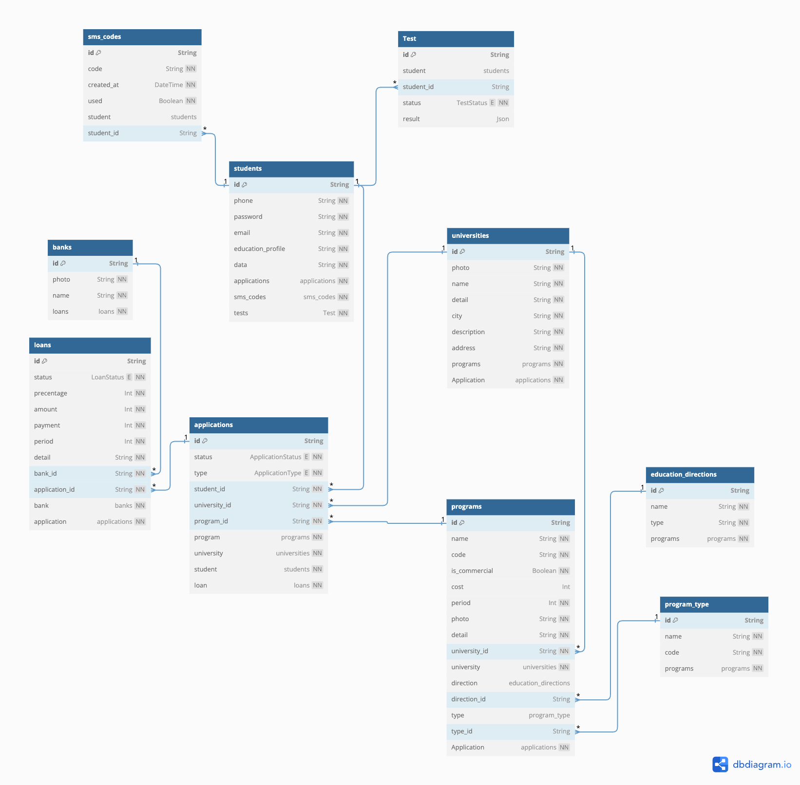

# EasyVUZ.ru Hackathon Backend <a href="https://nestjs.com/" target="blank"></a>

Backend приложения EasyVuz.ru для использования на хакатоне Финтех 2023 г.

Кейс: **Веб-сервис, который облегчит взаимодействие банков, учебных заведений и абитуриентов**

Привет Аквариум!

## Вклад ✨

Проект стал возможен благодаря этим замечательным людям

<!-- prettier-ignore-start -->
<!-- markdownlint-disable -->
<table>
  <tr>
    <td align="center"><a href="https://github.com/belyaev-dev"><br /><sub><b>Денис Беляев</b></sub></a><br /><a href="https://github.com/belyaev-dev/hackaton-backend/commits?author=belyaev-dev" title="Код">💻</a> <a href="https://github.com/belyaev-dev/hackaton-backend/commits?author=belyaev-dev" title="Documentation">📖</a></td>
    <td align="center"><a href="https://github.com/Svogg"><br /><sub><b>Олег</b></sub></a><br /><a href="https://github.com/belyaev-dev/easyvuz-backend/commits?author=Svogg" title="Код">💻</a></td>
    <td align="center"><a href="https://github.com/distanceOn"><br /><sub><b>Роман</b></sub></a><br /><a href="https://github.com/fintechsalad/frontend/commits?author=distanceOn" title="Код">💻</a></td>
  </tr>
</table>

<!-- markdownlint-restore -->
<!-- prettier-ignore-end -->

## ERD

[](https://dbdiagram.io/embed/64c6114d02bd1c4a5eec1524)

## 📓 Команды

### Список команд

```bash
# build the app
$ pnpm build

# format the code
$ pnpm lint

# start the app
$ pnpm start

# run in development mode
$ pnpm start:dev || pnpm dev

# build the app and run it in production mode
$ pnpm start:prod || pnpm prod

# generate Swagger JSON schema
$ pnpm swagger

# test both unit test and e2e test
$ pnpm test

# test all the e2e test
$ pnpm test:e2e

# test all the unit test
$ pnpm test:unit
```

### Локальная разработка

```bash
$ git clone https://github.com/fintechsalad/gateway-service.git

$ pnpm install

# Fill in require information in .env file
$ cp .env.example .env

# Linux / Mac users may require (allow git hook script executable)
$ chmod +x .husky -R

$ pnpm dev
``
